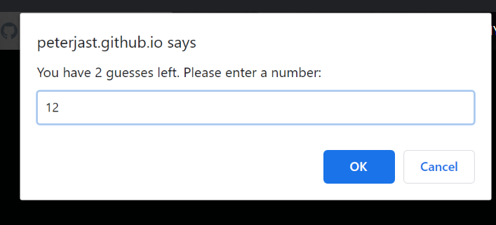
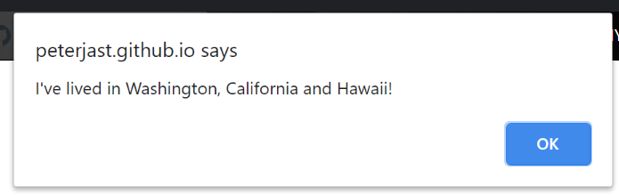

# lab-02

## About me guessing game that utilizes HTML, CSS, &amp; JavaScript
### Author: Peter Staker

This web application provides information about the author of the page. It includes a brief summary, and lists of work experience and education

Uses of JavaScript arrays, for loops and functions to create a series of guessing games.

### Features

    * Personalized Greeting

    * Yes or no guessing game

    * Random number guessing game

    * State guessing game

    * Information about the author

    * Lists of work and education experience

    * List of greatest actors

#### USER STORIES

#### Greeting

#####  User is prompted to input their name and then alerted with a personalized greeting

#### Yes or No Guessing Game

##### User is asked to guess the answers to a series of yes or no (y/n) questions in order to learn more about the author

##### User is notified if answer is correct or incorrect

#### Random Number Guessing Game

##### User is asked to guess a randomly generated number from 0-50

##### User has 4 guesses and is alerted if guess is too high or too low

#### State Guessing Game

##### User has six guesses to pick one of three states

#### Closing Message & Score

##### personalized message to the user tells them how many answers they got correct and then the about me page loads

