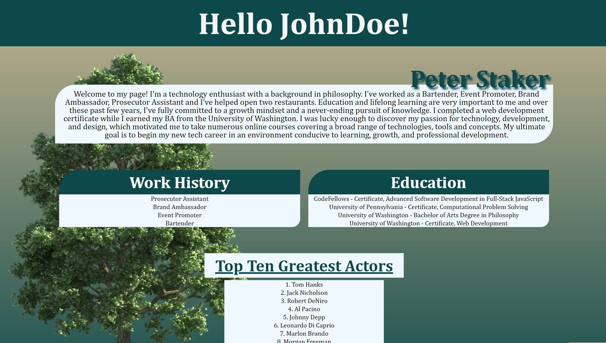
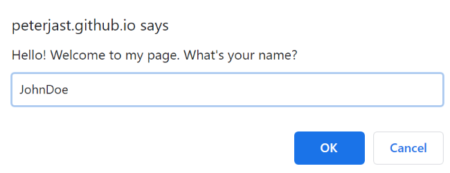
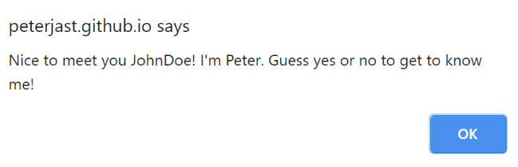
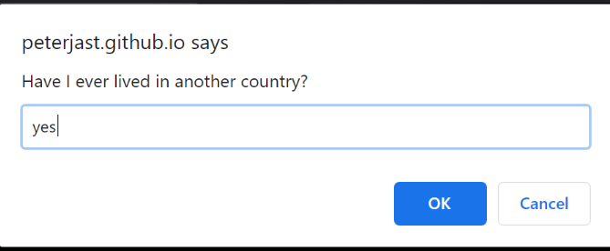
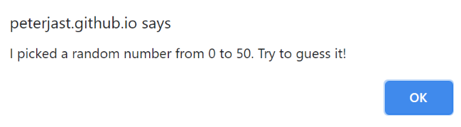
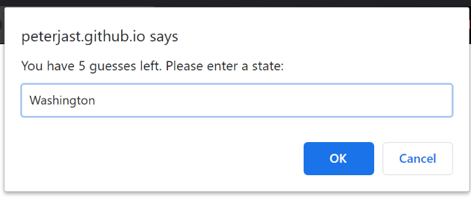
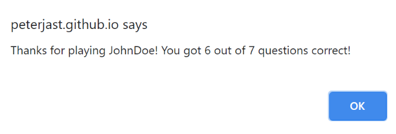

# About Me Guessing Game

## Author: Peter Staker

*This web application utilizes provides information about the author of the page*

*Use of JavaScript arrays, for loops and functions to create a series of guessing games*

### LANGUAGES USED

* JavaScript

* HTML

* CSS

### FEATURES

    * Personalized Greeting

    * Yes or no guessing game

    * Random number guessing game

    * State guessing game

    * Information about the author

    * Lists of work and education experience

    * List of greatest actors

### USER STORIES

#### Greeting

User is prompted to input their name and then alerted with a personalized greeting

#### Yes or No Guessing Game

User is asked to guess the answers to a series of yes or no (y/n) questions in order to learn more about the author

User is notified if answer is correct or incorrect

#### Random Number Guessing Game

User is asked to guess a randomly generated number from 0-50

User has 4 guesses and is alerted if guess is too high or too low

#### State Guessing Game

User has six guesses to pick one of three states

#### Closing Message & Score

personalized message for the user telling them their score how many answers they got correct 

